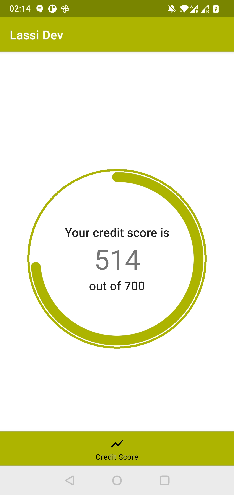
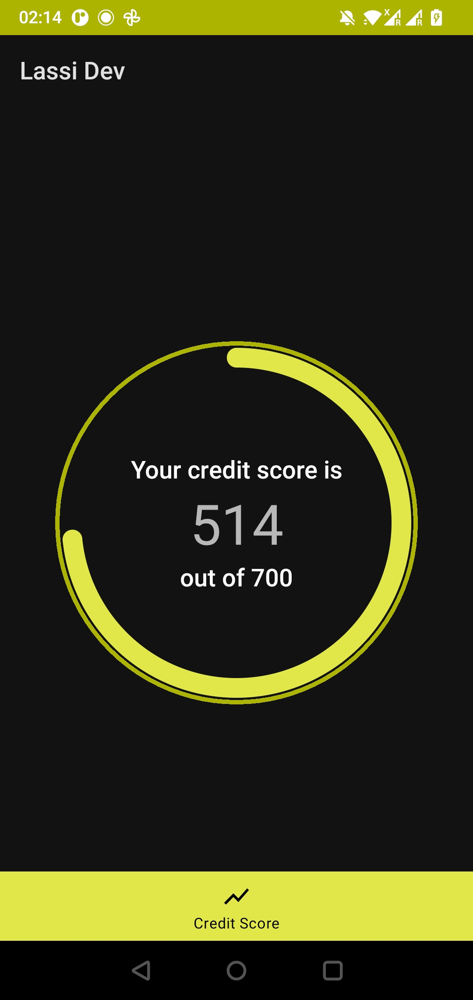
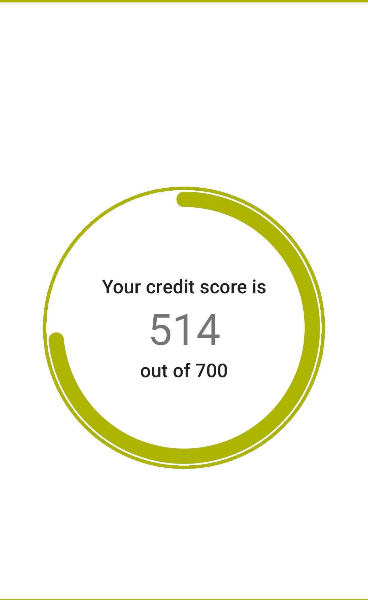
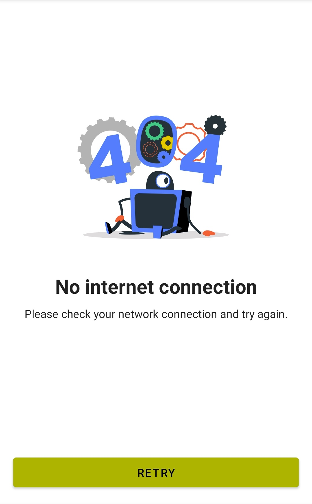

# Lassi

Lassi is a sample Android App that displays a users Credit Score Info

# Images

Light             |  Dark
:-------------------------:|:-------------------------:
  |  

# Features

- Dev/Prod Flavours
- Coroutines
- Multiple modules
- Clean Architecture
- Unit tests for ViewModel, Data, and Domain Layers
- Dark Mode Support
- UI Tests
- Design System/Components

# Libraries

- [Orbit MVI](https://orbit-mvi.org/)
  Orbit is a Redux/MVI-like library - but without the baggage. It's so simple we think of it as MVVM+.
- Koin for DI
- Retrofit
- OkHttp
- FragmentViewBindingDelegate-KT
  FragmentViewBindingDelegate-KT contains a helper delegate for auto-clearing the binding variable when the Fragment view is destroyed.
- Lottie for Animations


Testing Librarues
- MockWebServer
- JUnit
- Mockk
- Espresso
- Android Core Testing

# Architecture

Modules :

- :app
  Main app module. Contains a single MainActivity, and uses the Navigation Component to display Fragments in a BottomNavigationView.
  Additional Fragments can be added to the BottomNavigationView.

- :common-core
  Contains common dependencies. Currently this module has no kotlin files and is fairly redundant. The dependecies it contains could be provided to all feature modules in a better cleaner way.
  Currently it's being used in both data modules anf feature modules. Ideally I'd separate out the Android Dependencies from the common ones such as Navigation/Corotuines/Koin.
  (This is a code smell and i'm not too happy with it currently ngl)

- :ui-components
  Contains components that are part of a Design System.
  The primary benefit of design systems is their ability to replicate designs quickly by utilizing premade UI components and elements. Teams can continue to use the same elements over and over, reducing the need to reinvent the wheel and thus risking unintended inconsistency.
  The current implementation for ui-componets also contains :
    - Theme
    - Colors
    - Dimens
    -
  The reason these are defined here is so that they're in a single location, and avoids duplication.
  As a further step, this module can be converted to a stand alone repository, so that there's a process to add/change desings (ideally going through desingers and project maintainers)

- :resources
  Cotains two separated modules
    - :strings
      This allows for a single source for all strings in the app, the key benefit is that when the app would be translated, all strings are in a single location which makes it easie to implement and test.
    - :drawable
      This allows for a single source for all drawables in the app, and prevents duplications.

- :data
  Contains all of our data/domain modules
    - :common-data
      Currently this module has the di for the networking layers, and some utilities for Retrofit.
      In the future you could have di for the database, and other functions that will be used by all data modules
    - :credit-score-data
      Each Feature will have it's own data module, that depends on the common-data module for dependencies/shared functions
      Directory Structure:
        ```
            ├── main
            │   └── java
            │       └── com
            │           └── example
            │               └── credit_score_data
            │                   ├── datasource
            │                   │   ├── CreditScoreDataSource.kt
            │                   │   └── remote
            │                   │       ├── CreditScoreAPIService.kt
            │                   │       ├── CreditScoreDataSourceImpl.kt
            │                   │       └── model
            │                   │           ├── CreditData.kt
            │                   │           └── mapper
            │                   │               └── CreditScoreAPIMapper.kt
            │                   ├── di
            │                   │   └── credit_score_data_module.kt
            │                   └── domain
            │                       ├── CreditScoreRepository.kt
            │                       ├── model
            │                       │   └── CreditScoreData.kt
            │                       ├── repository
            │                       │   └── CreditScoreRepositoryImpl.kt
            │                       └── response
            │                           └── GetCreditScoreResponse.kt
        ```

      The UseCase ( present in the corresponding :feature module) will depend on the CreditScoreRepository interface to interact with the domain layer.
      The Domain Layer Implementation (CreditScoreRepositoryImpl interacts with the data layers through the CreditScoreDataSource interface.

- :credit-score (Feature Module)
  Each Feature in the app has it's own self contained module. These modules depend on the corresponding data module for interction.
    ```
    └── src
    ├── main
    │   ├── AndroidManifest.xml
    │   ├── java
    │   │   └── com
    │   │       └── example
    │   │           └── credit_score
    │   │               ├── di
    │   │               │   └── credit_score_module.kt
    │   │               ├── mapper
    │   │               │   └── CreditScoreMapper.kt
    │   │               ├── model
    │   │               │   └── CreditScoreHubData.kt
    │   │               ├── ui
    │   │               │   └── credit_score_hub
    │   │               │       ├── CreditScoreHubFragment.kt
    │   │               │       ├── CreditScoreHubIntent.kt
    │   │               │       ├── CreditScoreHubState.kt
    │   │               │       └── CreditScoreHubViewModel.kt
    │   │               └── usecase
    │   │                   └── GetCreditScoreUseCase.kt
    │   └── res
    │       ├── layout
    │       │   └── fragment_credit_score_hub.xml
    │       └── values
    ```
  Each feature module is simple. It contains a Fragment, that has it's correspondng business logic.
  There's a UseCase that's injected in the ViewModule.

# UI Components

There's two reusable Componets

## DonutIndicator



Reusable Component to dispaly usage.
```xml
    <com.example.ui_components.DonutIndicator
        android:id="@+id/creditScoreIndicator"
        android:layout_width="match_parent"
        android:layout_height="wrap_content"
        app:title="title"
        app:subtitle="subtitle"
        app:value="3"
    />
```

##### Attributes
The following attributes can be changed for a `DonutIndicator`:

| Type          | Relevant attributes           |Description                    |
|---------------|-------------------------------|-------------------------------|
| String        | `app:title`                   | Used to set the Title         |
| String        |`app:description`              | Used to set the Description   |
| Integer       | `app:value`                   | Used to set the Value         |

#### CollectionView



```xml
        <com.example.ui_components.CollectionView
            android:id="@+id/errorCollectionView"
            android:layout_width="match_parent"
            android:layout_height="0dp"
            android:layout_weight="1"
            app:animSrc="@raw/lottie_error"
            app:subtitle="subtitle"
            app:title="title" />
```

##### Attributes
The following attributes can be changed for a `CollectionView`:

| Type          | Relevant attributes               |Description                    |
|---------------|-----------------------------------|-------------------------------|
| String        | `app:title`                       | Used to set the Title         |
| String        | `app:description`                  | Used to set the Description   |
| Reference     | `app:animSrc`                     | Used to set Lottie Resource   |

# Things I'd improve

- The UI Tests use sleep to wait for background operations to complete. This is really bad. (really not proud of this one, but there's room for improvement)
- Add Jacoco for Test Coverage Reporting
- Add Detekt/Ktlint
- More Documentation on how to run the app/run tests